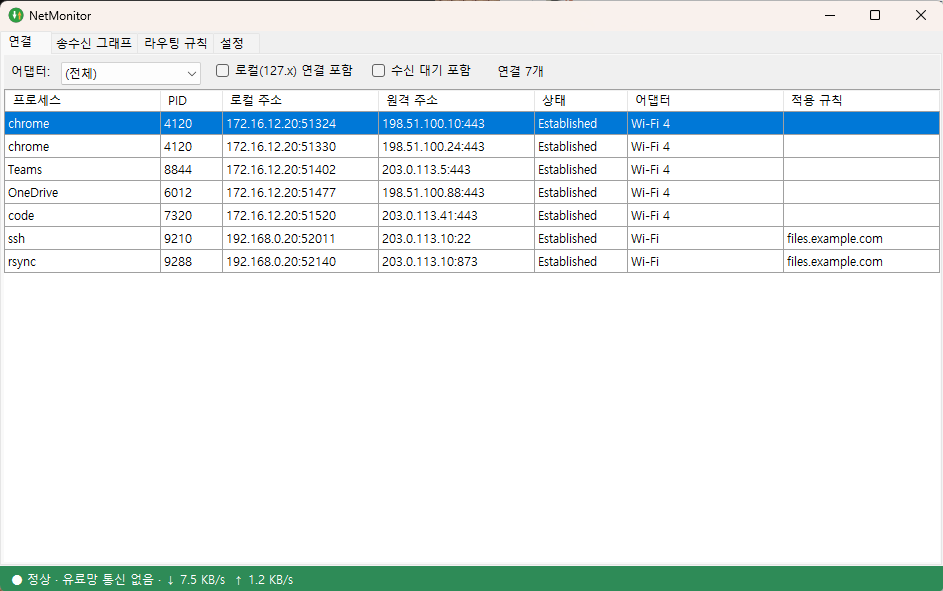
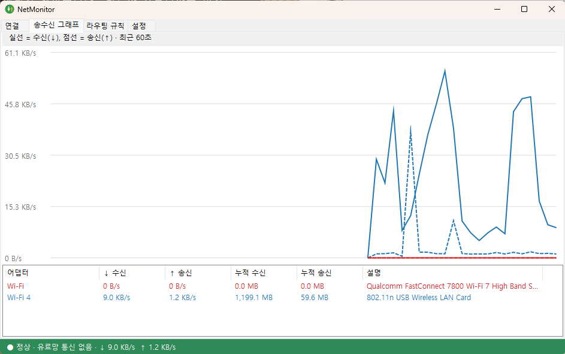
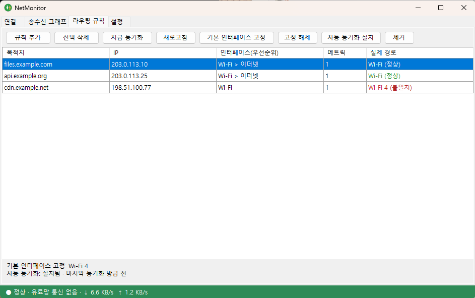
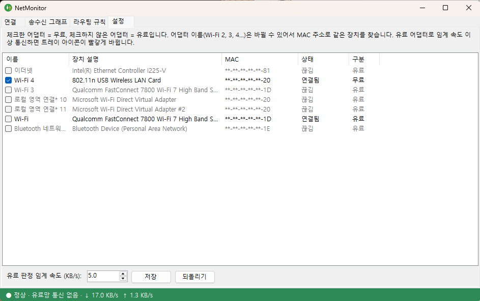

# NetMonitor

어떤 네트워크 어댑터(Wi-Fi, 이더넷 등)로 통신하는지 보여주는 경량 Windows 트레이 앱입니다.
C# WinForms 단일 exe(약 33KB)이고, 윈도우에 기본 포함된 .NET Framework 4.x 위에서 돌아가므로 별도 런타임 설치가 필요 없습니다.


| 연결 | 송수신 그래프 |
|---|---|
|  |  |
| **라우팅 규칙** | **설정 (무료/유료 어댑터)** |
|  |  |

> 스크린샷은 `--demo` 모드로 찍었습니다. 연결과 규칙은 문서용 예시 데이터이고 MAC 주소는 가려져 있습니다.

## 기능

- **연결 탭**: 활성 TCP 연결마다 프로세스, PID, 로컬/원격 주소, 상태, 사용 어댑터, 적용 규칙을 3초마다 갱신해 보여줍니다. 어댑터별 필터, 로컬(127.x) 연결 및 수신 대기 포함 옵션이 있습니다.
- **송수신 그래프 탭**: 어댑터별 수신(실선)/송신(점선) 속도를 최근 60초 동안 1초 간격으로 그립니다. 하단 표에 현재 속도와 누적량이 나옵니다.
- **라우팅 규칙 탭**: `WifiRoute` 규칙(목적지 → 인터페이스 우선순위)을 조회, 추가, 삭제, 동기화하고 기본 인터페이스 고정, 자동 동기화 작업 설치/제거를 할 수 있습니다. 각 규칙의 실제 경로는 Windows가 고르는 인터페이스(`GetBestInterface`)로 확인해 정상/불일치를 표시합니다.
- **트레이 상주**: 창을 닫으면 트레이로 숨고, 아이콘 툴팁에 전체 ↓/↑ 속도가 표시됩니다. 더블클릭으로 창을 열고, 우클릭 메뉴의 `종료`로만 끝납니다. 중복 실행은 막습니다.
- **신호등 아이콘**: 트레이 아이콘 색과 창 하단 표시줄로 상태를 알려줍니다. 상태가 나빠지면 풍선 알림도 한 번 띄웁니다.
  - 🔴 빨강: 무료 목록에 없는(유료) 어댑터로 임계 속도 이상 통신 중 (최근 3초 기준)
  - 🟡 노랑: 라우팅 규칙 중 실제 경로가 정상이 아닌 것이 있음 (불일치, 경로 없음, DNS 실패). 30초마다 점검
  - 🟢 초록: 위 둘 다 아님
  - 어떤 어댑터가 무료인지는 **설정 탭**에서 체크박스로 고릅니다(기본값은 `Wi-Fi 4`). 체크하지 않은 어댑터는 모두 유료로 봅니다.
  - 어댑터 이름(`Wi-Fi 2`, `Wi-Fi 3`, `Wi-Fi 4`...)은 재연결하거나 USB 동글을 다시 꽂으면 바뀔 수 있어서, 이름이 아니라 **MAC 주소**로 같은 장치를 찾습니다. 이름이 바뀌어도 무료 지정이 유지됩니다.
- **윈도우 시작 시 자동 실행**: 트레이 우클릭 메뉴에서 체크하면 `HKCU\Software\Microsoft\Windows\CurrentVersion\Run`에 등록됩니다(관리자 권한 불필요). 시작 시에는 `--tray`로 창 없이 트레이에서 시작합니다.

## 빌드와 실행

SDK 설치는 필요 없고, Windows에 포함된 `csc.exe`를 사용합니다.

```powershell
.\build.ps1                          # bin\NetMonitor.exe 생성 (+ WifiRoute.ps1 사본)
.\build.ps1 -Deploy C:\Tools\NetMonitor   # 추가로 해당 폴더에 배포 (실행 중이면 종료 후 교체)
bin\NetMonitor.exe                   # 창으로 시작
bin\NetMonitor.exe --tray            # 트레이로 바로 시작
```

규칙 변경은 같은 폴더의 `WifiRoute.ps1`을 호출하며, 이때 UAC 승격 창이 한 번 뜹니다. 조회만 할 때는 일반 권한으로 동작합니다.

## 구성 파일

exe와 같은 폴더에 두는 파일입니다.

| 파일 | 설명 |
|---|---|
| `NetMonitor.exe` | 앱 본체 (소스: `Core.cs`, `MainForm.cs`, `Program.cs`) |
| `WifiRoute.ps1` | 목적지별 라우팅 규칙을 실제 라우트에 반영하는 도구 (NetMonitor가 호출) |
| `NetMonitor.settings.json` | 무료 어댑터 목록과 유료 판정 임계 속도. 설정 탭에서 저장하면 갱신되고, 처음 실행하면 기본값으로 자동 생성 (git 제외) |
| `WifiRoute.config.json` | 내 규칙. `WifiRoute.config.example.json`을 복사해서 사용 (git 제외) |
| `WifiRoute.default.json` | 기본 인터페이스 고정 설정 (`-SetDefault`로 생성, git 제외) |
| `WifiRoute.log` | 동기화 로그 (git 제외) |

규칙 파일 형식:

```json
[
  { "Target": "example.com", "InterfaceAlias": ["Wi-Fi", "Wi-Fi 2"], "Metric": 1 }
]
```

`InterfaceAlias`는 문자열 하나 또는 우선순위 배열이고, 배열이면 앞에서부터 현재 연결된 첫 인터페이스를 사용합니다. 게이트웨이 IP는 저장하지 않고 동기화 때마다 그 인터페이스의 현재 게이트웨이를 조회하므로, Wi-Fi가 다른 SSID로 바뀌어도 따라갑니다. 이를 자동화하려면 규칙 탭의 `자동 동기화 설치`(또는 `WifiRoute.ps1 -InstallTask`)를 사용하세요.

## 설정 (무료/유료 어댑터)

**설정 탭**에 어댑터가 모두 나열됩니다. 무료로 쓰는 어댑터를 체크하고 유료 판정 임계 속도를 정한 뒤 `저장`을 누르면 바로 적용됩니다.

- 지금 연결돼 있지 않은 어댑터는 회색으로 표시되고, 무료로 저장해 둔 어댑터가 빠져 있으면(USB 동글을 뽑아둔 경우 등) `없음(저장됨)`으로 목록에 남습니다.
- 임계 속도(기본 5 KB/s) 미만의 백그라운드 통신은 유료망 사용으로 치지 않습니다.

설정 파일을 직접 고칠 수도 있습니다. MAC이 있으면 MAC으로 먼저 판단하고, 없으면 이름이나 장치 설명의 일부로 판단합니다.

```json
{
  "FreeAdapters": [
    { "Name": "Wi-Fi 4", "Mac": "AA-BB-CC-00-11-22", "Description": "802.11n USB Wireless LAN Card" }
  ],
  "PaidThresholdKBps": 5
}
```

예전 형식(`"FreeAdapters": ["Wi-Fi 4"]`)도 읽을 수 있고, 설정 탭에서 저장하면 새 형식으로 바뀝니다.

## 스크린샷 다시 찍기

`NetMonitor.exe --demo`로 실행하면 실제 연결·규칙 대신 예시 데이터를 보여주고 MAC 주소를 가립니다(설정은 저장되지 않음). 본 앱이 트레이에서 실행 중이어도 따로 뜹니다.

## WifiRoute.ps1 단독 사용

```powershell
.\WifiRoute.ps1 -Status
.\WifiRoute.ps1 -AddTarget example.com -Interface "Wi-Fi,Wi-Fi 2" -Metric 1
.\WifiRoute.ps1 -RemoveTarget example.com
.\WifiRoute.ps1 -SetDefault "Wi-Fi"       # 기본 인터페이스 고정
.\WifiRoute.ps1 -ClearDefault
.\WifiRoute.ps1 -Sync                     # 규칙 즉시 동기화
.\WifiRoute.ps1 -InstallTask              # 2분마다 + 로그온/부팅 시 자동 동기화
.\WifiRoute.ps1 -UninstallTask
```

## 한계

- 연결 탭은 IPv4 TCP만 표시합니다 (UDP, IPv6 제외).
- 소스는 .NET Framework의 `csc.exe`(C# 5)로 컴파일되므로 최신 C# 문법은 쓰지 않습니다.
- 이전 PowerShell 판(`NetMonitor.ps1`)은 C# 판으로 대체되어 제거되었습니다. git 기록에서 볼 수 있습니다.
