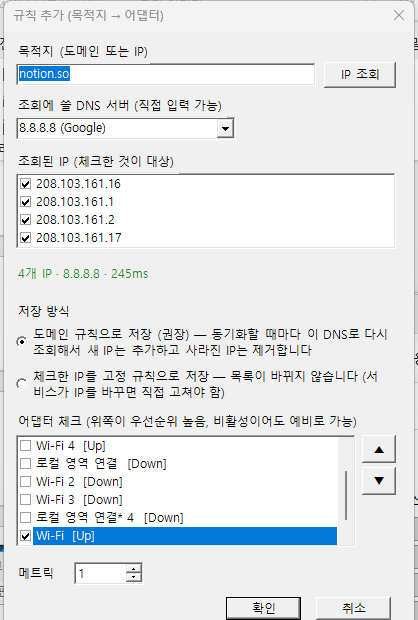

# NetMonitor

**원하는 목적지를, 원하는 네트워크 어댑터로 보내고, 실제로 그렇게 가고 있는지 지켜보는** Windows 트레이 앱입니다.

Wi-Fi 동글, 내장 무선랜, 이더넷, 테더링처럼 어댑터가 여러 개일 때 Windows는 보통 하나만 골라서 모든 통신을 보냅니다. NetMonitor는 여기에 **목적지별 라우팅 규칙**을 얹어서 "평소 트래픽은 무료 회선으로, 이 서버만 저 회선으로"처럼 통신 경로를 직접 정하게 해주고, 그 결과를 **실시간으로 모니터링**합니다.

> **이 도구는 네트워크 어댑터가 2개 이상 연결된 Windows 환경에서 라우팅을 하기 위한 것입니다.**
> 유선랜 + 무선랜, 무선랜 + 무선랜(내장 + USB 동글), 테더링 등 어댑터 종류는 상관없습니다. 어댑터가 하나뿐이면 보낼 곳을 고를 수 없으므로 모니터링 기능만 의미가 있습니다.

C# WinForms 단일 exe(약 44KB)이고, 윈도우에 기본 포함된 .NET Framework 4.x 위에서 돌아가므로 별도 런타임 설치가 필요 없습니다.


## 핵심 기능

### 1. 목적지별 라우팅 — 원하는 목적지를 원하는 어댑터로


- **목적지 → 어댑터 규칙**: 도메인이나 IP를 지정하고 보낼 어댑터를 고릅니다. 앱에서 `규칙 추가` 한 번이면 끝이고, 재부팅해도 유지되는 영구 라우트로 등록됩니다.
- **DNS 서버를 골라 IP를 미리 확인**: `규칙 추가` 창에서 도메인을 입력하고 DNS 서버(시스템 기본, `8.8.8.8` 등, 직접 입력 가능)를 고른 뒤 `IP 조회`를 누르면 그 서버가 돌려주는 **IP를 전부** 보여줍니다. 어떤 IP가 라우트로 만들어질지 저장하기 전에 확인할 수 있습니다.
- **IP가 바뀌어도 자동으로 따라감**: 도메인 규칙은 동기화할 때마다 지정한 DNS로 **A 레코드 전체**를 다시 조회해서 새 IP는 라우트에 추가하고, 사라진 IP는 제거합니다. 같은 도메인이 여러 IP를 돌려주거나 IP가 자주 바뀌는 서비스(Notion, 각종 CDN 등)도 규칙 밖으로 새지 않습니다. 원하면 조회된 IP를 고정 규칙으로 저장할 수도 있습니다.


- **우선순위 목록(장애 대체)**: 어댑터를 여러 개 체크하고 ▲▼로 순서를 정하면, 위쪽부터 보면서 **지금 연결된 첫 번째 어댑터**로 보냅니다. 1순위 Wi-Fi가 끊기면 자동으로 2순위로 넘어갑니다.
- **기본 어댑터 고정**: "별다른 지정이 없는 모든 통신은 이 어댑터로"를 고정할 수 있습니다. Windows가 재연결 때마다 제멋대로 바꾸는 우선순위를 되돌려 놓습니다.
- **네트워크가 바뀌어도 따라감**: 게이트웨이 주소를 저장하지 않고, 동기화할 때마다 그 어댑터의 *현재* 게이트웨이를 찾아 라우트를 다시 씁니다. 다른 SSID에 붙거나 DHCP로 주소가 바뀌어도 규칙은 그대로 유효합니다. 자동 동기화 작업을 설치하면 2분마다 + 로그온/부팅 시 알아서 맞춰줍니다.
- **정말 그 경로로 가는지 검증**: 규칙마다 Windows가 실제로 고르는 인터페이스를 조회해 `정상` / `불일치` / `경로 없음`을 표시합니다. 규칙만 만들어 두고 "되고 있겠지" 하고 넘어가지 않아도 됩니다.

> 예: 평소 통신은 무료 USB Wi-Fi(`Wi-Fi 4`)로 두고, 업무 서버·NAS·특정 사이트만 내장 무선랜(`Wi-Fi`)으로 보내기. 또는 반대로 요금이 드는 회선은 꼭 필요한 목적지에만 쓰기.

### 2. 모니터링 — 실제로 어디로 가고 있는지

| 연결 | 송수신 그래프 |
|---|---|
|  |  |

- **연결 탭**: 활성 TCP 연결마다 프로세스, PID, 로컬/원격 주소, 상태, **사용 중인 어댑터**, 그리고 **어느 규칙이 적용됐는지**를 3초마다 보여줍니다. 어댑터별 필터가 있어서 "이 어댑터로 나가는 연결만" 볼 수 있습니다.
- **송수신 그래프 탭**: 어댑터별 수신(실선)/송신(점선) 속도를 최근 60초 동안 1초 간격으로 그리고, 현재 속도와 누적량을 표로 보여줍니다.

### 3. 신호등 아이콘 — 창을 열지 않아도 알 수 있게

트레이 아이콘 색과 창 하단 표시줄이 상태를 알려주고, 나빠질 때는 풍선 알림이 한 번 뜹니다.

| 색 | 의미 |
|---|---|
| 🟢 초록 | 정상. 유료 어댑터로 나가는 통신이 없고 모든 규칙의 실제 경로가 정상 |
| 🟡 노랑 | **라우팅 이상**. 규칙 중 실제 경로가 정상이 아닌 것이 있음 (불일치, 경로 없음, DNS 실패). 30초마다 점검 |
| 🔴 빨강 | **유료 어댑터로 통신 중**. 무료로 지정하지 않은 어댑터로 임계 속도 이상 통신 (최근 3초 기준) |

### 4. 트레이 상주 + 자동 시작

창을 닫으면 트레이로 숨고, 툴팁에 전체 ↓/↑ 속도가 보입니다. 우클릭 메뉴에서 `윈도우 시작 시 자동 실행`을 체크하면 로그온할 때 창 없이 트레이로 시작합니다(관리자 권한 불필요).

## 이런 환경에서 쓰세요

| 구성 | 예시 |
|---|---|
| **유선랜 + 무선랜** | 이더넷은 회사/집 회선, Wi-Fi는 다른 회선. 특정 서버만 Wi-Fi로 우회하거나, 평소엔 이더넷을 쓰다가 끊기면 Wi-Fi로 자동 전환 |
| 무선랜 + 무선랜 | 내장 Wi-Fi와 USB Wi-Fi 동글을 동시에 연결해 무료/유료 회선을 나눠 쓰기 |
| 무선랜 + 테더링 | 평소엔 Wi-Fi, 특정 목적지만 휴대폰 테더링으로 |

라우팅은 어댑터 종류를 구분하지 않고, **연결돼 있고(IPv4 주소와 기본 게이트웨이가 있는) 어댑터**면 규칙에 쓸 수 있습니다. 규칙의 어댑터 이름은 `이더넷`, `Wi-Fi`, `Wi-Fi 2`처럼 Windows가 보여주는 이름 그대로 고릅니다.

> 유선과 무선을 **동시에** 연결해 둬야 합니다. 일부 노트북/드라이버/Windows 정책은 유선이 연결되면 Wi-Fi를 자동으로 끊거나 새 연결을 막습니다. 이 경우에는 아래 [문제 해결](#문제-해결)을 보세요.

## 설치

**요구 사항**: Windows 10/11 (Windows PowerShell 5.1과 .NET Framework 4.x는 기본 포함이라 따로 설치할 것이 없습니다). 라우팅을 쓰려면 어댑터가 2개 이상 연결돼 있어야 합니다.

1. [Releases](../../releases)에서 최신 `NetMonitor-vX.Y.Z.zip`을 내려받아 적당한 폴더에 풉니다.
2. 풀린 폴더에서 PowerShell을 열고 설치 스크립트를 실행합니다.

   ```powershell
   powershell -ExecutionPolicy Bypass -File .\install.ps1                # 설치 + 시작 메뉴 바로가기 + 실행
   powershell -ExecutionPolicy Bypass -File .\install.ps1 -Autostart     # 위 + 윈도우 시작 시 트레이로 자동 실행
   ```

   `%LOCALAPPDATA%\NetMonitor`에 설치되고(관리자 권한 불필요), 내려받은 파일의 차단 표시를 풀어 SmartScreen 경고를 막습니다. `-Dir`로 설치 폴더를 바꿀 수 있습니다. 다시 실행하면 업데이트이고, 기존 설정/규칙은 유지됩니다.
3. 처음 실행하면 **설정 탭**이 열립니다. 무료로 쓰는 어댑터를 체크하고 `저장`하세요. 저장하기 전에는 유료망 감지가 꺼져 있습니다(어떤 어댑터가 무료인지 모르기 때문입니다).
4. `라우팅 규칙` 탭에서 규칙을 추가합니다. 규칙을 적용할 때 관리자 권한 확인(UAC) 창이 한 번 뜹니다.

> 설치 스크립트 없이도 `NetMonitor.exe`와 `WifiRoute.ps1`을 **같은 폴더**에 두고 `NetMonitor.exe`를 실행하면 됩니다. 쓰기 가능한 폴더에 두세요(설정 파일을 같은 폴더에 저장합니다. `Program Files`는 권한 때문에 맞지 않습니다).

**제거**: 설치 폴더의 `uninstall.ps1`을 실행합니다.

```powershell
powershell -ExecutionPolicy Bypass -File "$env:LOCALAPPDATA\NetMonitor\uninstall.ps1" -RemoveRoutes
```

`-RemoveRoutes`는 앱이 등록한 라우팅 규칙과 기본 어댑터 고정을 함께 해제합니다(UAC 필요). 이 옵션 없이 지우면 라우트는 Windows에 그대로 남습니다. `-Purge`를 붙이면 설정/규칙/로그 파일까지 삭제합니다.

## 사용 순서

1. `라우팅 규칙` 탭 → `규칙 추가`에서 목적지(예: `example.com`)와 보낼 어댑터를 고릅니다. 여러 개를 고르면 위쪽이 우선순위입니다.
2. 필요하면 `기본 인터페이스 고정`으로 평소 통신을 보낼 어댑터를 정합니다.
3. `자동 동기화 설치`를 눌러 두면 네트워크가 바뀌어도 규칙이 유지됩니다.
4. `연결` / `송수신 그래프` 탭이나 트레이 아이콘 색으로 결과를 확인합니다.

라우트를 쓰는 작업(추가, 삭제, 동기화 등)은 관리자 권한이 필요해서 `WifiRoute.ps1`이 UAC 승격 창을 한 번 띄웁니다. 보기만 할 때는 일반 권한으로 동작합니다.

## 무료/유료 어댑터 설정


신호등의 빨강 판정에 쓰입니다. **설정 탭**에서 무료로 쓰는 어댑터를 체크하고 유료 판정 임계 속도를 정한 뒤 `저장`하면 바로 적용됩니다. 체크하지 않은 어댑터는 모두 유료로 봅니다. 처음 설치한 직후에는 무료 어댑터가 정해져 있지 않아서 한 번 저장하기 전까지는 유료망 감지가 꺼져 있습니다(상태 표시줄에 안내가 나옵니다).

- 어댑터 이름(`Wi-Fi 2`, `Wi-Fi 3`, `Wi-Fi 4`...)은 재연결하거나 USB 동글을 다시 꽂으면 바뀔 수 있어서, 이름이 아니라 **MAC 주소**로 같은 장치를 찾습니다. 이름이 바뀌어도 무료 지정이 유지됩니다.
- 지금 연결돼 있지 않은 어댑터는 회색으로 표시되고, 무료로 저장해 둔 어댑터가 빠져 있으면(동글을 뽑아둔 경우 등) `없음(저장됨)`으로 목록에 남습니다.
- 임계 속도(기본 5 KB/s) 미만의 백그라운드 통신은 유료망 사용으로 치지 않습니다.

설정 파일(`NetMonitor.settings.json`)을 직접 고칠 수도 있습니다. MAC이 있으면 MAC으로 먼저 판단하고, 없으면 이름이나 장치 설명의 일부로 판단합니다.

```json
{
  "FreeAdapters": [
    { "Name": "Wi-Fi 4", "Mac": "AA-BB-CC-00-11-22", "Description": "802.11n USB Wireless LAN Card" }
  ],
  "PaidThresholdKBps": 5
}
```

예전 형식(`"FreeAdapters": ["Wi-Fi 4"]`)도 읽을 수 있고, 설정 탭에서 저장하면 새 형식으로 바뀝니다.

## 라우팅이 동작하는 방식

NetMonitor의 라우팅은 `WifiRoute.ps1`이 담당하고, 앱은 그 위의 화면입니다.

1. 규칙의 목적지를 DNS로 IP(IPv4)로 풀어서 **호스트 라우트(`IP/32`)** 를 만듭니다. 규칙에 DNS 서버(`Dns`)가 지정돼 있으면 그 서버로, 없으면 시스템 DNS로 조회하고, 도메인 규칙은 기본적으로 A 레코드 **전체**(최대 32개)를 대상으로 합니다.
2. 규칙의 어댑터 목록에서 지금 연결된 첫 어댑터를 고르고, 그 어댑터의 **현재 게이트웨이**를 next hop으로 지정해 영구 라우트(`netsh ... store=persistent`)로 등록합니다. 등록 후에는 실제로 반영됐는지 다시 조회해서 검증합니다.
3. 동기화할 때마다 1~2를 반복하므로, 어댑터가 바뀌거나 게이트웨이/목적지 IP가 바뀌어도 맞춰집니다. 규칙별로 마지막에 만든 IP 목록을 상태 파일(`WifiRoute.state.json`)에 기억해 두었다가, 지금 DNS 결과에 없는 IP의 라우트는 제거합니다. 다른 규칙이 같이 쓰는 IP는 지우지 않고, DNS 조회가 일시적으로 실패하면 기존 라우트를 그대로 둡니다.
4. 기본 어댑터 고정은 어댑터의 인터페이스 메트릭을 조정해서(고정 어댑터 10, 나머지 50) Windows가 기본 경로로 그 어댑터를 쓰게 합니다.
5. 앱은 `GetBestInterface`로 "이 목적지는 지금 어느 어댑터로 나가는가"를 물어서 규칙과 비교합니다.

## 구성 파일

exe와 같은 폴더에 두는 파일입니다.

| 파일 | 설명 |
|---|---|
| `NetMonitor.exe` | 앱 본체 (소스: `Core.cs`, `MainForm.cs`, `Program.cs`) |
| `WifiRoute.ps1` | 목적지별 라우팅 규칙을 실제 라우트에 반영하는 도구 (NetMonitor가 호출) |
| `WifiRoute.config.json` | 내 라우팅 규칙. `WifiRoute.config.example.json`을 복사해서 사용 (git 제외) |
| `WifiRoute.default.json` | 기본 어댑터 고정 설정 (`-SetDefault`로 생성, git 제외) |
| `WifiRoute.state.json` | 규칙별로 마지막에 만든 IP 목록. 사라진 IP를 정리하는 데 쓰며 직접 고칠 필요 없음 (자동 생성, git 제외) |
| `NetMonitor.settings.json` | 무료 어댑터 목록과 유료 판정 임계 속도. 설정 탭에서 저장하면 갱신, 처음 실행하면 기본값 생성 (git 제외) |
| `WifiRoute.log` | 동기화 로그 (git 제외) |

규칙 파일 형식:

```json
[
  { "Target": "example.com", "InterfaceAlias": ["Wi-Fi", "Wi-Fi 2"], "Metric": 1 }
]
```

`InterfaceAlias`는 문자열 하나 또는 우선순위 배열입니다. 배열이면 앞에서부터 현재 연결된 첫 어댑터를 사용합니다.

도메인 규칙에는 선택 필드를 둘 수 있습니다. 없으면 시스템 DNS로 조회하고 A 레코드 전체를 사용합니다(예전에 만든 규칙도 그대로 동작합니다).

```json
{ "Target": "example.com", "InterfaceAlias": "Wi-Fi", "Metric": 1, "Dns": "8.8.8.8", "AllRecords": true }
```

| 필드 | 설명 |
|---|---|
| `Dns` | 이 규칙의 IP 조회에 쓸 DNS 서버(IPv4). 비우면 시스템 기본 |
| `AllRecords` | `true`(기본): A 레코드 전체를 라우트로 만들고 변화를 추적 / `false`: 첫 번째 IP만 |

## WifiRoute.ps1 단독 사용

앱 없이 명령줄만으로도 같은 라우팅을 쓸 수 있습니다.

```powershell
.\WifiRoute.ps1 -Status
.\WifiRoute.ps1 -AddTarget example.com -Interface "Wi-Fi,Wi-Fi 2" -Metric 1
.\WifiRoute.ps1 -AddTarget notion.so -Interface "Wi-Fi" -Dns 8.8.8.8      # 8.8.8.8로 조회한 A 레코드 전체를 추적
.\WifiRoute.ps1 -AddTarget example.com -Interface "Wi-Fi" -FirstOnly      # 첫 번째 IP만
.\WifiRoute.ps1 -AddTarget "203.0.113.1,203.0.113.2" -Interface "Wi-Fi"   # 여러 목적지를 한 번에 (관리자 확인 1회)
.\WifiRoute.ps1 -RemoveTarget example.com
.\WifiRoute.ps1 -SetDefault "Wi-Fi"       # 기본 어댑터 고정
.\WifiRoute.ps1 -ClearDefault
.\WifiRoute.ps1 -Sync                     # 규칙 즉시 동기화
.\WifiRoute.ps1 -InstallTask              # 2분마다 + 로그온/부팅 시 자동 동기화
.\WifiRoute.ps1 -UninstallTask
```

## 문제 해결

| 증상 | 확인할 것 |
|---|---|
| **유선을 꽂으면 Wi-Fi가 끊겨요** | 일부 노트북은 유선이 연결되면 Wi-Fi를 자동으로 끕니다. 제조사 설정(BIOS/전원 관리 유틸리티)과 어댑터 드라이버 속성에서 "유선 연결 시 무선 끄기" 계열 옵션을 끄세요. Windows 정책 "인터넷 또는 Windows 도메인에 대한 동시 연결 수 최소화"(`fMinimizeConnections`)가 켜져 있으면 두 번째 연결이 제한될 수도 있습니다. |
| **특정 사이트만 안 열려요** (다른 사이트는 되는데) | 연결 중인 망이 그 사이트를 막고 있을 수 있습니다. 규칙 추가 창에서 `IP 조회`로 사이트의 IP를 확인하고, 막히지 않은 어댑터로 보내는 규칙을 만드세요. 시스템 DNS가 이상한 값을 주는 것 같으면 DNS 서버를 `8.8.8.8` 등으로 바꿔 조회해 비교해 볼 수 있습니다. |
| 규칙을 만들었는데 `불일치`/`경로 없음` | 규칙에 적은 어댑터가 지금 연결돼 있고 기본 게이트웨이가 있는지 확인하세요. 연결돼 있는데도 어긋나면 `지금 동기화`를 누르세요. |
| 규칙 추가가 아무 반응이 없어요 | 관리자 권한 확인(UAC) 창이 다른 창 뒤에 떠 있거나 거절됐을 수 있습니다. 로그 파일 `WifiRoute.log`를 확인하세요. |
| 자동 동기화가 `설치된 것으로 추정`으로 나와요 | 작업이 SYSTEM 소유라 일반 권한 앱에서는 직접 조회가 안 됩니다. 동기화 로그의 마지막 시각이 최근이면 정상입니다. |
| 실행할 때 SmartScreen 경고가 떠요 | 서명되지 않은 exe라서 그렇습니다. `install.ps1`로 설치하면 차단 표시가 풀립니다. 직접 쓸 때는 파일 속성에서 `차단 해제`를 체크하세요. |
| 빨강으로 바뀌지 않아요 | 설정 탭에서 무료 어댑터를 한 번 저장했는지 확인하세요. 임계 속도 미만의 통신은 무시합니다. |

## 소스에서 빌드 / 릴리스 만들기

SDK 설치는 필요 없고, Windows에 포함된 `csc.exe`를 사용합니다.

```powershell
.\build.ps1                               # bin\NetMonitor.exe 생성
.\build.ps1 -Deploy C:\Tools\NetMonitor   # 원하는 폴더에 배포 (실행 중이면 종료 후 교체)
.\package.ps1                             # dist\NetMonitor-vX.Y.Z.zip + SHA256SUMS.txt 생성 (릴리스용)
bin\NetMonitor.exe --tray                 # 트레이로 바로 시작 (창으로 시작하려면 인자 없이)
```

버전은 `Program.cs`의 `AssemblyVersion`/`AssemblyFileVersion`에서 올립니다.

## 스크린샷 다시 찍기

`NetMonitor.exe --demo`로 실행하면 실제 연결·규칙 대신 예시 데이터를 보여주고 MAC 주소를 가립니다(설정은 저장되지 않음). 본 앱이 트레이에서 실행 중이어도 따로 뜹니다. 이 문서의 스크린샷도 이 모드로 찍었습니다.

## 한계

- 목적지별 라우팅은 **어댑터가 2개 이상 동시에 연결**돼 있어야 의미가 있습니다. 유선+무선은 동작하는 구조이지만, 개발 PC에서 직접 검증한 조합은 무선+무선(내장 Wi-Fi + USB Wi-Fi 동글)입니다.
- 라우팅과 연결 목록은 **IPv4** 기준입니다. 연결 탭은 TCP만 표시합니다 (UDP, IPv6 제외).
- 도메인 규칙은 동기화 시점(자동 동기화 설치 시 2분 간격)의 DNS 결과를 따라갑니다. IP가 바뀐 직후 다음 동기화 전까지는 새 IP가 규칙 밖으로 나갈 수 있습니다. 한 번에 최대 32개 IP까지 처리합니다.
- 서비스가 CDN처럼 DNS 응답마다 지역/시점에 따라 전혀 다른 IP를 주는 경우, 이 PC에서 조회한 IP만 라우트로 만들어지므로 그 서비스의 모든 서버를 보장하지는 못합니다. 주소를 안정적으로 알 수 있는 서비스에 적합합니다.
- 목적지 단위(IP)로 라우팅하며, 프로세스/포트 단위 분리는 지원하지 않습니다.
- 소스는 .NET Framework의 `csc.exe`(C# 5)로 컴파일되므로 최신 C# 문법은 쓰지 않습니다.
- 이전 PowerShell 판(`NetMonitor.ps1`)은 C# 판으로 대체되어 제거되었습니다. git 기록에서 볼 수 있습니다.
